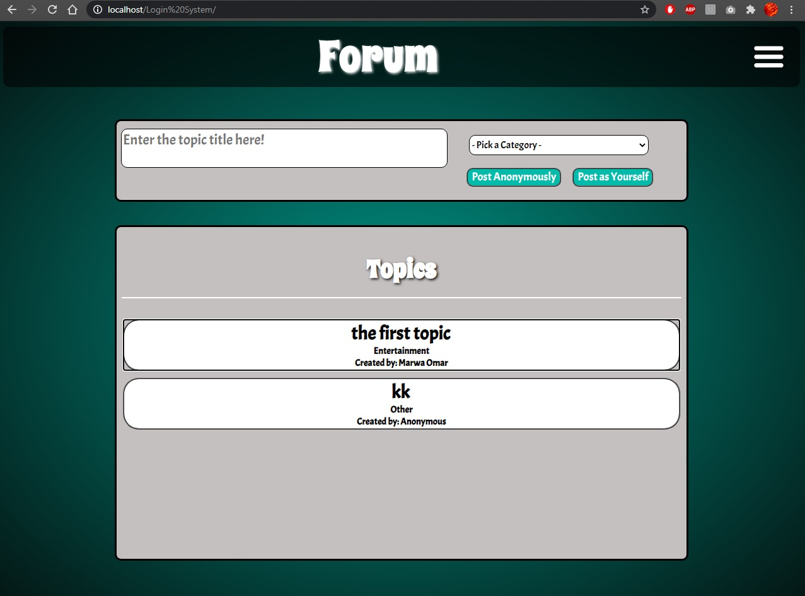
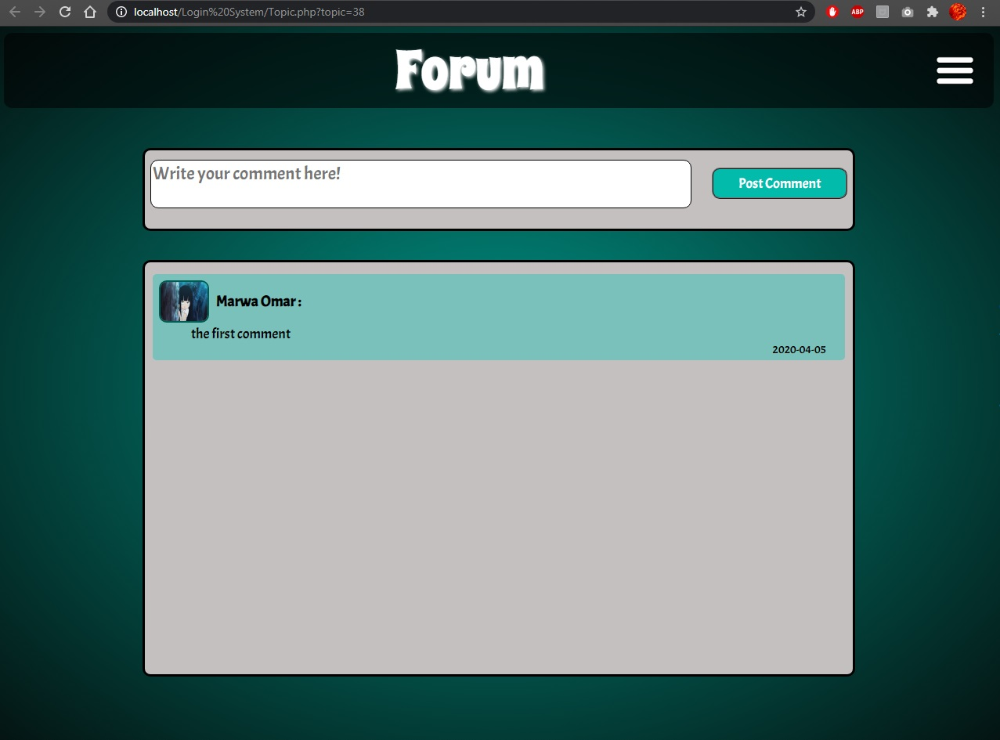
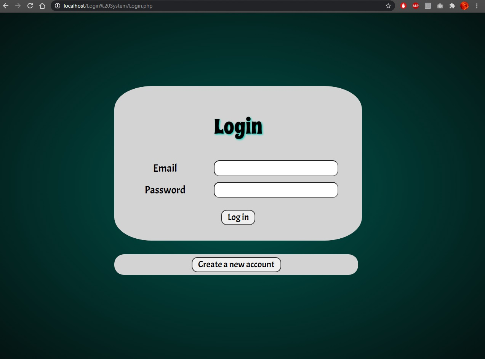
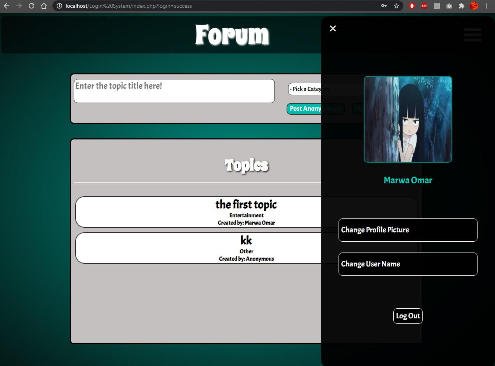

<h1>Forum</h1>
This is a simple forum in which you can create an account, post a topic, and write comments on topics. Made this website to practice and learn more about html,css,js,php,
and sql.
<h3>Screenshots</h3>
  
  
  
  
